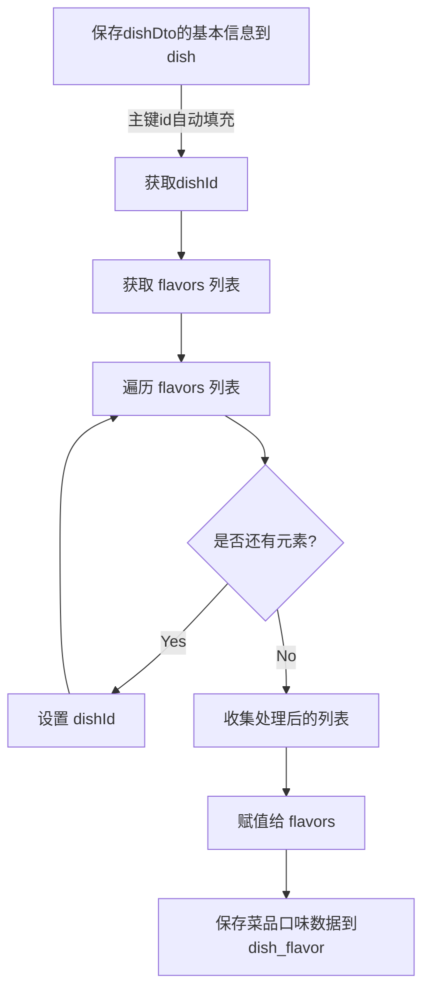

# [Markdown基础语法](https://markdown.com.cn)

# [Mermaid 图表工具中文网](https://mermaid.nodejs.cn/)

# application.yml部分

    spring:
      application:
        #应用名称 , 可写可不写
        name: waimai

**驼峰命名法**

    mybatis-plus:
      configuration:
        #在映射实体或者属性时，将数据库中表名和字段名中的下划线去掉
    	#实体：address_book ---> AddressBook
    	#属性：user_info --->userInfo
        map-underscore-to-camel-case: true

# 静态资源映射

&emsp;&emsp;默认的映射位置位于static或temple，本项目需要添加WebMvcConfig配置类修改映射位置。

1.  继承WebMvcConfigurationSupport
2.  重写父类addResourceHandlers和extendMessageConverters方法

# 创建服务端通用返回结果类

&emsp;&emsp;返回结果包含int类型的code、字符串类型的msg、泛型data和hashmap类型的map。
类中定义static属性的方法\:success返回data数据和code=1；errer返回msg信息和code=0。

# 后台管理端

## 登录功能

&emsp;&emsp;loginApi方法使用axios向后端/employee/login接口发起post请求，携带表单loginForm的数据。
后端login**响应post请求时应该使用@RequestBody解析json数据**，使之与Employee对象绑定。
HttpServletRequest是一个接口，而不是抽象类。因此，不能直接new（）实例化它。在spring MVC中使用依赖注入机制传递给控制器。
new一个LambdaQueryWrapper对象，使用eq方法设置数据库中的用户名与请求数据中的用户名匹配查询条件，此条件将会传递给getOne方法，用于从数据库中查找符合条件的唯一记录。

## 过滤器和拦截器

&emsp;&emsp;过滤器和拦截器都是基于AOP思想实现的，此项目采用的是过滤器。
过滤器来自servlet，在容器启动的时候会初始化（init），整个程序运行期只会被调用一次；doFilter方法里写具体过滤请求的实现代码。
拦截器来自springfarmework，创建的拦截器方法需要实现HandlerInterceptor 接口。

**区别**

*   出身不同：过滤器是javax.servlet，拦截器是org.springfarmework.web.servlet。
*   触发时机不同: 请求的执行顺序是：请求进入容器 > 进入过滤器 > 进入 Servlet > 进入拦截器 > 执行控制器（Controller）
*   实现不同：过滤器是基于方法回调实现的，拦截器是基于动态代理（底层是反射）实现的。
*   支持的项目类型不同：过滤器要依赖 Servlet 容器，它只能用在 Web 项目中；而拦截器是 Spring 中的一个组件，因此拦截器既可以用在 Web 项目中，同时还可以用在 Application 或 Swing 程序中。
*   使用的场景不同：拦截器主要用来实现项目中的业务判断的，过滤器通常是用来实现通用功能过滤的。

### 登录检查过滤器

&emsp;&emsp;创建一个类实现Filter接口，首先需要new一个支持通配符的路径匹配器AntPathMatcher对象用于后续匹配uri是否属于urls中的某一个，其次要根据业务逻辑重写doFilter方法检查登陆状态。如果用户已登陆，获取session中存放的用户id并传给BaseContext类。

### 请求过滤

&emsp;&emsp;过滤器使用@WebFilter注解时需要指定过滤路径(urlPatterns = "/\*")
为了能访问HTTP特有的方法和属性，我们需要将servletRequest 和 servletResponse向下转型为 HttpServletRequest 和 HttpServletResponse 类型，进而通过HTTP特有的方法获取到请求的URI。
在部分请求中，我们不需要过滤，因此我们要定义一些不需要过滤的请求路径。
此项目定义了一个字符串数组类型的urls来放置这些特殊url路径，然后引入spring工具包中的AntPathMatcher类，通过for循环遍历从urls中获取upl，再使用AntPathMatcher类中的match方法对url和URI进行匹配，匹配成功则通过FilterChain的doFilter方法跳出过滤，未匹配成功的路径会执行是否登录的校验流程。
通过分析前端代码得知在request.js中有响应拦截器，当响应数据中的 code 为 0 且 msg 为 'NOTLOGIN'时重定向到登录页面，所以后端只需将R.error("NOTLOGIN")转换为json数据返回给前端即可。

## 新增员工

&emsp;&emsp;post请求携带的Employee是json形式，所以save方法参数要添加@RequestBod注解。
注册员工时服务端会提供一个初始密码，使用MD5技术对其加密然后保存在数据库中。根据Employee表结构，前端并未提供完整的插入数据，因此需要服务端添加创建时间/人物和更新时间/人物。为了简化业务逻辑、确保数据的一致性，此项目采用了MyBatis-Plus提供的自动填充功能。此项目的service层和dao层都依赖于继承MyBatis-Plus封装的IService和BaseMapper接口。

### 公共字段自动填充

&emsp;&emsp;字段createTime、updateTime、createUser和updateUser不止会出现在一个表中，在新增数据和修改数据时需要重复设置这些字段。MyBatis-Plus考虑到这种情况，提供了公共字段自动填充功能，可以减少手动操作、确保数据的一致性、简化业务逻辑等。

设置方式：

1.  在实体类中需要自动填充的字段添加@TableField注解并根据需求指定自动填充策略:

        FieldFill.INSERT: 只在插入时填充。
        FieldFill.UPDATE: 只在更新时填充。
        FieldFill.INSERT_UPDATE: 在插入和更新时都填充。

2.  创建一个自定义填充逻辑类（元数据对象处理器）实现MyBatis-Plus的MetaObjectHandler接口。根据此项目的插入和更新场景，重写insertFill和updateFill，使用`metaObject.setValue("属性名",值)`将当前用户和当前时间写入数据库。因为此操作是在有登录状态执行的，所以当前用户id可以通过BaseContext类获取。

&emsp;&emsp;**组件元数据处理器在项目启动时会加载至spring容器中，当执行插入或更新操作时在才会执行对应的方法。**

### 什么是ThreadLocal?

&emsp;&emsp;ThreadLocal是JDK提供的一个类。

&emsp;&emsp;客户端每次发送HTTP请求，对应的服务端都会分配一个新的线程来处理，在处理过程中涉及到的方法使用的是同一个线程。
ThreadLocal不是一个线程，而是线程的局部变量。当使用ThreadLocal维护变量时，ThreadLocal为每个使用该变量的线程提供独立的变量副本，所以每一个线程都可以独立的改变自己的副本，而不会影响到其他线程所对应的副本。ThreadLocal为每一个线程提供单独一份存储空间，具有线程隔离的效果，只有在线程内才能获得对应的值，线程外不能访问。所以，我们可以基于ThreadLocal存储当前用户id。

ThreadLocal常用方法:

*   public void set(T value)设置当前线程的线程局部变量的值
*   publicT get()返回当前线程所对应的线程局部变量的值

&emsp;&emsp;我们可以在LogincheckFilter的doFilter方法中**获取当前登录用户id**，并调用ThreadLocal的set方法来设置当前线程的线程局部变量的值(用户id)，然后在MyMetaObiectHandler的updateFill方法中调用ThreadLocal的get方法来获得当前线程所对应的线程局部变量的值(用户id)。

#### BaseContext工具类

&emsp;&emsp;该类是基于ThreadLocal封装的工具类，用于用户保存和获取当前登录用户id。此项目通过在LoginCheckFilter.java判断用户已登录时使用setCurrentId将id反射给BaseContext的threadLocal常量。

#### 为什么常量不可变，但是threadLocal被修改了?

***源代码：***

```java
private static final ThreadLocal<Long> threadLocal = new ThreadLocal<>();
```

***解释：***

&emsp;&emsp;虽然 threadLocal 变量本身是 final 的，这意味着它的引用不能被重新赋值，但 ThreadLocal 对象的内容是可以修改的。具体来说：

*   final 关键字：确保 threadLocal 变量的引用不能被重新赋值。也就是说，你不能将 threadLocal 指向另一个 ThreadLocal 实例。
*   ThreadLocal 对象的内容：每个线程都有自己的 ThreadLocal 副本，可以通过 set 方法修改其存储的值。

#### 为什么BaseContext工具类中的方法要用static?

1.  无需实例化：
    静态方法可以直接通过类名调用，而不需要创建类的实例。这使得调用更加方便和高效。
    例如，`BaseContext.setCurrentId(id);` 直接调用，而不需要 `new BaseContext.setCurrentId(id);`。
2.  全局可用：
    静态方法是全局可用的，可以在任何地方通过类名调用，不受对象实例的限制。
    这使得工具类的方法可以像内置语言功能一样使用。
3.  节省资源：
    静态方法和静态变量只在类加载时初始化一次，不会为每个实例重复创建，从而节省内存和计算资源。
    特别适用于那些频繁使用的工具方法，避免了每次调用时都需要创建和销毁对象的开销。
4.  线程安全：
    静态方法通常不依赖于类的实例状态，因此更容易实现线程安全。
    当然，如果静态方法操作共享数据，仍然需要注意线程同步问题。
5.  代码清晰：
    使用静态方法可以明确地表示这些方法是工具方法，而不是类的行为。
    这有助于代码的可读性和维护性，使其他开发人员更容易理解代码的意图。

如何创建类的实例?

&emsp;&emsp;在 Java 中，创建类的实例通常通过使用 new 关键字来调用类的构造函数。

> 创建类的实例并调用方法
>
> > *   创建类的实例：
> >     使用 new 关键字调用类的构造函数来创建实例。
> > *   调用实例方法：
> >     通过实例对象调用实例方法。
> > *   调用静态方法：
> >     通过类名直接调用静态方法。

#### 什么情况下适合设置静态方法?

*   提供工具方法，方便调用。
*   创建工厂方法，封装对象的创建逻辑。
*   实现单例模式，确保全局唯一性。
*   提供常量访问方法，封装常量。
*   提供辅助方法，提高代码复用性和可读性。
*   管理配置，集中处理配置相关操作。

通过合理使用静态方法，可以使代码更加简洁、高效和易于维护。

## 全局统一异常处理

&emsp;&emsp;新增员工时会出现username重复的状况，代码会出现SQLIntegrityConstraintViolationException异常，原本需要在save方法中编写try-catch逻辑，为了方便维护，此项目统一整合到DisposeException类中管理。
`@RestControllerAdvice(annotations = {RestController.class, Controller.class})`
统一异常处理类中添加了@RestControllerAdvice注解后，该类监控带有@RestController、@Controller注解的类，将其中的异常抛给统一异常处理类进行处理。
新增员工时会出现SQLIntegrityConstraintViolationException，因此在addException方法上添加`@ExceptionHandler(SQLIntegrityConstraintViolationException.class)`即可捕获该异常并执行异常处理逻辑。

## 分页查询

&emsp;&emsp;此项目在config包中使用@Bean注解创建了一个MyBatis-Plus提供的分页插件mybatisPlusInterceptor 实例，通过addInnerInterceptor 方法添加了一个 PaginationInnerInterceptor 拦截器，用于支持分页查询。
分页查询方法会接受page、pageSize和name三个参数，当全查询时，name作为添加查询参数会为NULL，因此在使用LambdaQueryWrapper制作条件构造器时需要使用对name做出判空处理。

## 启用/禁用 and 修改信息

&emsp;&emsp;启用/禁用员工账号和修改员工信息在本质上都是更新数据库的操作，因此可以共用一个`update`方法。当分页查询时返回的long型数据一般会在前端丢失精度，所以此项目需要添加基于jackson的对象映射器，将Java对象**序列化**为json，或者将json**反序列化**为Java对象。然后就会发现原来Long型的id变成了String，List类型的updateTime转换为了"yyyy-MM-dd HH\:mm\:ss"格式的String。
**更新操作可以使用MP封装的通过主键更新，也可以创建UpdateWrapper构造条件，通过 .eq 和 .setSql 方法更新。**

## 分类管理功能

&emsp;&emsp;新增菜品/套餐分类和修改分类共用的是同一个弹窗，通过v-model与classData双向绑定。在data中设置classData默认值，当点击新增时给classData赋值；slot-scope="scope" 用于定义作用域插槽，当点击修改时会通过 scope.row 传递当前行的值给classData回显。

## 文件上传下载功能

文件上传时，对页面的 from 表单有如下要求：

| 条件                            | 解释                |
| ----------------------------- | ----------------- |
| method="post"                 | 采用post方式提交数据      |
| enctype="multipart/from-data" | 采用multipart格式上传文件 |
| type="file"                   | 使用input的file控件上传  |

```html
示例：
<from method="post" action="/common/upload" enctype="multipart/from-data">
    <input name="myFile" type="file"/>
    <input type="submit" value="提交"/>
</from>
```

&emsp;&emsp;spring-web包底层是通过apache的commons-fileupload、commons-io实现文件上传。我们只需要在controller层的方法中声明一个MultipartFile类型的参数既可接收上传的文件。
文件下载是指将文件从服务端以流的形式传输给客户端。

### 文件上传

&emsp;&emsp;为了方便后期修改文件存储位置，不把路径写死在方法中，而是添加到 application.yml 中，需要用到的时候可以直接在类中定义变量，使用`@Value("${}")`注解给变量赋值。为了避免文件名重复，修改原文件名，使用UUID随机生成一串数字作为文件名（UUID并不能完全避免文件名重复，只是几率很小）。
**upload方法必须是post请求，参数名必须是file，参数类型必须是 MultipartFile 。**

1.  使用MultipartFile类提供的 getOriginalFilename方法获取原文件名。
2.  使用String类提供的substring截取文件名后缀。
3.  使用UUID随机生成一串数字与后缀拼接作为文件名。
4.  实例化一个File对象，将目录值赋给它。
5.  判断当前目录是否存在，不存在就创建该目录。
6.  拼路径，用MultipartFile提供的transferTo()将文件转存至该路径。
7.  将文件名返回给前端，后续功能需要前端提供图片名称。

&emsp;&emsp;transferTo() 是基于 Spring 框架的上传方法，可以帮助处理上传文件的转存；
**FileOutputStream也可以处理文件上传**，适合在手动处理文件写入时使用，示例：

```java
try (FileOutputStream fos = new FileOutputStream(new File(basePath + fileName))) {
    fos.write(file.getBytes()); // 获取文件的字节内容并写入
} catch (IOException e) {
    e.printStackTrace();
}
```

### 文件下载

&emsp;&emsp;在前端文件中可以找到图片回显就是当文件上传完成后自动调用文件下载功能接口，从服务端流式获取图片文件。
**图片回显就是将文件从服务端下载至浏览器中。**
大致步骤如下：

1.  使用输入流（FileInputStream）读取文件
2.  使用输出流（ServletOutputStream）将文件回显至浏览器

详细流程：

> 1.首先需要实例化一个FileInputStream对象读取指定路径的文件`new FileInputStream(new File(basePath + name));`
> 2.其次需要设置返回类型`httpServletResponse.setContentType("image/jpeg");`
> 3.然后定义中间变量和用于接受输入流内容的字符数组，使用while循环读取数组（`a != -1`表示内容还没读取完毕；`a = 1`表示读取完毕），在每次读取后，将 bytes 数组中的数据通过 servletOutputStream 写入到浏览器。每次写入后，调用 flush 方法刷新输出流，确保数据立即发送。
>
> ```Java
> int a;
> byte[] bytes = new byte[1024];//创建长度为1024的数组
> while ((a = fileInputStream.read(bytes)) != -1) //将输入流读取到的内容放到这个数组中，当a=-1时表示读取完成
> {
>     servletOutputStream.write(bytes, 0, a);//通过输出流向浏览器写。off的值表示数组索引byte[0],读取长度为a
>     servletOutputStream.flush();//刷新
> }
> ```
>
> 4.及时关闭输入流和输出流，释放资源。

### FileOutputStream 与 ServletOutputStream

&emsp;&emsp;FileOutputStream 和 ServletOutputStream 都是 Java 中用于输出流的类，但它们的用途和应用场景不同。

**1. FileOutputStream**

**作用：** FileOutputStream 是 Java 标准库中的类，用于将数据写入文件。

**使用场景：** 通常用于将数据保存到服务器的文件系统中，例如将文本或二进制数据写入文件。

**方法：** 提供了 write(int b)、write(byte\[] b) 等方法，可以逐字节或逐块地写入数据。

**2. ServletOutputStream**

**作用：** ServletOutputStream 是 Java Servlet API 提供的类，专门用于将数据发送到客户端（通常是浏览器）。

**使用场景：** 一般用于 HTTP 响应中，将数据直接写回客户端，例如返回文件、图像或其他二进制数据。

**方法：** ServletOutputStream 继承了 OutputStream，提供了 print()、println() 等方法，适合将数据写入 HTTP 响应流。

***区别总结：***

|    特性    |  FileOutputStream | ServletOutputStream |
| :------: | :---------------: | :-----------------: |
|  **用途**  |    将数据写入服务器端文件    |  将数据写入客户端（HTTP 响应）  |
| **使用场景** |  保存文件或数据在服务器文件系统中 |  将响应内容发送到客户端，如下载文件  |
| **主要方法** | `write(byte[] b)` | `print()，println()` |
| **典型应用** |     日志文件、数据存储     | Web API、文件下载、动态页面生成 |

## 新增菜品功能

&emsp;&emsp;首先明确此功能涉及到 dish 和 dish\_flavor 两张表，因此需要在保存方法上添加**事务控制**（`@Transactional`）。
**只需要在DishServiceImpl类上添加`@Transactional`就能够控制事务了？** 非也，我们还需要在启动类上添加`@EnableTransactionManagement`开启对事务管理的支持。
**前后端交互过程：**

1.  add.html 页面加载时钩子函数调用`/category/list?type=1`获取菜品分类列表并展示到下拉框中。

> &emsp;&emsp;服务端api的接收参数可以定义String类型的type，也可以定义 Category 实体类。使用后者更好一些，因为它的通用性更强，如果后期传入 Category 其他属性作为参数，就不用再次创建新方法了。
> 因为要返回list列表数据，所以返回值类型使用`R<List<Category>>`
> **实现步骤：**
>
> > 需要先实例化一个LambdaQueryWrapper构造器 --> 添加查询条件 --> 添加排序条件 --> 使用IService提供的list接口接收LambdaQueryWrapper查询结果 --> 返回数据

1.  图片上传至服务器

> upload方法，返回文件名name。详情见[文件上传](#文件上传)

1.  图片下载至浏览器，回显图片

> 接收name参数，使用输入流到指定路径读取文件，再通过输出流回显，无需返回值。详情见[文件下载](#文件下载)

1.  保存，发送post请求将json数据发送至服务端

> &emsp;&emsp;因为json数据中包含有Dish以外的属性值，所以save方法不能使用Dish类型接收参数。此时就需要创建一个DishDTO类继承Dish类，DishDTO作为子类可以继承父类的属性，也能够创建自己的子类 flavors 属性。因为json数据中 flavors 是一个集成了name和value的列表，而name和value是DishFlavor的属性，所以`private List<DishFlavor> flavors = new ArrayList<>();`。
> 
> &emsp;&emsp;因为接收的是json数据，所以形式参数要加入@RequestBody注解。
> 
> &emsp;&emsp;前端传递的原始dishDto是不包含菜品id的，当执行`this.save()`将基本信息传给dish表时，MP给表中自动填充了菜品id，因此`dish_flavors`表需要的菜品id就能够使用`dishDto.getId()`获取。原始dishDto的flavors属性是列表形式的DishFlavor对象，所以我们需要给列表中的每个DishFlavor对象赋dishId值，可以使用forEach或stream流（此处使用后者，采用的是Lambda表达式）。最后使用IService接口提供的saveBatch方法向`dish_flavors`表批量插入数据。saveBatch方法接收的参数是实体对象集合，而flavors恰好是DishFlavor实体对象的list集合。
> **具体实现流程图如下：**



#### 详解`wrapper.eq(category.getType() != null, Category::getType, category.getType());`

&emsp;&emsp;eq方法的第一个参数是布尔类型的`condition`（`category.getType() != null`），用于判断这个条件是否执行；第二个参数是`column`（`Category::getType`），用于指定要比较的列；第三个函数是`val`（`category.getType()`），代表要比较的值。

&emsp;&emsp;`Category::getType` 是 Java 8 引入的方法引用语法。它用于引用现有类的实例方法或静态方法。它的含义如下：

&emsp;&emsp;`Category`：这是一个类名，表示 Category 类。

&emsp;&emsp;`::`：这是方法引用操作符，用于连接类名和方法名。

&emsp;&emsp;`getType`：这是 Category 类中的一个实例方法。

**作用：**
&emsp;&emsp;`Category::getType` 在这里的作用是引用 Category 类中的 getType 方法。

&emsp;&emsp;在查询构建器中，`Category::getType` 可以用于获取 Category 对象的 type 属性值。

**内部实现**

1.  条件判断：wrapper 首先检查 category.getType() != null 是否为 true。
    如果为 true，则继续执行下一步。
    如果为 false，则不添加任何条件，直接结束。
2.  方法引用解析：wrapper 使用 Category::getType 方法引用来确定 Category 类中的 type 属性对应的数据库表列名。这通常是通过**反射**或其他元数据机制实现的。
3.  值比较：wrapper 将 category.getType() 的值作为比较值，构建一个 SQL 查询条件，确保数据库表中的相应列值与 category.getType() 的值相等。

**总结：**

&emsp;&emsp;`Category::getType`确定查询哪一列，`category.getType()`确定值，标题代码相当于`select * from Category where type=category.getType()`

#### 为什么执行`this.save(dishDto)`这一步后dishDto就有了id值？

&emsp;&emsp;首先查看Dish表，会发现id是主键。

&emsp;&emsp;其次查看Dish实体类，会发现Id属性上加有`@TableId(value = "id", type = IdType.ASSIGN_ID)`

&emsp;&emsp;IdType是MP提供的枚举类定义了`ASSIGN_ID`，根据注释可知，只有当插入对象ID 为空且主键类型为number或string时，`ASSIGN_ID`才会使用雪花算法分配ID，自动填充。

## 菜品管理分页查询

既然是分页，就依旧使用MP提供的分页器Page。
**首先需要明确多表间的关系：**

| 表名       |   描述  | 关键字段            |
| -------- | :---: | --------------- |
| dish     |  菜品表  | id、category\_id |
| category | 菜品分类表 | id              |

*   dish表的category\_id与category表的id绑定

**明确api信息：**

  GET请求；参数是page、pageSize、name（name用于条件查询）；需要返回“菜品名称、图片、菜品分类、售价、菜品描述、售卖状态、最后操作时间”。

**根据表结构可知：**

  查询dish表的结果中“菜品分类”只是菜品分类表中的id值，无法满足返回数据的需求。因此，该功能涉及到两张表查询。

**代码开发思路：**

  分页操作的第一步肯定是实例化一个Page对象，传入参数page和pageSize并指定Dish表（指定Dish实体类是为了明确分页查询的对象类型）。由于IService提供的page分页方法第二个参数是一个queryWrapper，所以需要创建一个条件构造器LambdaQueryWrapper，也许指定泛型是Dish对象。接下来就该向条件构造器里添加查询条件和排序条件，此处的查询条件使用like方法模糊查询更佳。此处需要判断name是否为空，当name为空时说明是全查询，无需添加`where name = #{name}`,反之亦然。执行查询操作后会将数据存放在实例化的Page\<Dish>对象page1，此时的page1包含total、size、current和ArrayList类型的records。

  在DishDto中我们还定义了categoryName字段，用于我们此时将page1中的category\_id转换为具体的category\_name；因此，DishDto对象可以满足前端的数据需求，我们需要再实例化一个Page对象，传入参数page和pageSize并指定DishDto表，使用`BeanUtils.copyProperties()`将page1 复制给page2。我们知道page1中records并不满足数据需求，所以在复制时要先忽略records，将其处理后再复制给page2。

  建立一个Dish集合用来接收records，再建立一个DishDto集合用来接收处理后的records，records使用stream流式逐条处理数据，将分类名称（category\_name）从category表中查出来。

```java
records.stream().map((item)->{
    }).collect(collectors.toList())
```

## 修改菜品

思路：

> 1.  点击“修改”时，查询菜品分类和菜品信息并回显数据。
> 2.  修改数据后点击“保存”，发送菜品信息更新指令。
> 3.  update菜品基本信息，删除原falvor数据并将新口味数据插入到表中。

### 查询菜品信息

  因为有菜品口味数据，所以我们需要返回DishDto对象。将id传给服务端->根据id查询dish表->将数据拷贝到DishDto对象中->根据dish\_id查询口味表->将口味表数据放到DishDto对象的flavors字段中->将DishDto返回。

### 更新菜品信息

  使用PUT方法将表单数据传给服务端->根据id将基本信息更新至dish表->根据dish\_id删除口味表中的原数据->使用stream流在每条数据中添加菜品id->往口味表中批量插入新的口味数据。

***注意：涉及到多表操作时要添加事务注解@Transactional***

## 新增套餐

思路：

> 1.  获取套餐分类和菜品分类
> 2.  根据菜品id获取对应的数据
> 3.  上传并回显图片
> 4.  发送post请求将表单数据插入数据库setmeal、setmeal\_dish表中

套餐分类和菜品分类的区别就是参数值不同，因此可以共用同一个接口。

  因为插入数据涉及到两张表，所以要添加事务控制。因为Setmeal实体类不符合要求，我们需要使用SetmealDto类接收前端数据。要先将基本数据插入到setmeal表中，再使用stream流给每条菜品数据添加套餐id，最后将数据整理成List插入到setmeal\_dish表中。

## 套餐分页

思路：

> 1.  创建MP提供的Page\<Setmeal>对象和Page\<SetmealDto>对象
> 2.  使用LambdaQueryWrapper查询数据库，将结果储存到Page\<Setmeal>对象中
> 3.  使用对象拷贝至需要的Page\<SetmealDto>对象，先不拷贝records属性
> 4.  使用stream流对records进行处理，将基本数据拷贝至SetmealDto对象
> 5.  根据分类id获取分类名称，将分类名称逐条添加到SetmealDto对象中
> 6.  将stream流的最终数据存储到Page\<SetmealDto>对象records属性中

## 删除套餐

思路：

> 1.  明确单个删除和批量删除用的是同一个接口，只能删除停售的套餐
> 2.  接收的参数是一个Long型的List类型，里面是套餐id
> 3.  删除前先查询List中是否有起售的套餐，如果有就直接抛出异常
> 4.  根据id删除套餐表数据
> 5.  SetmealDish中对应的套餐id是setmealId，根据setmealId删除关系表数据

涉及多表操作，需要在service层实现类中添加事务控制

# 移动端
## 验证码注册登录
思路：
>1. 在过滤器中将发送验证码、登录和登出添加无需处理的请求路径中，修改login.html的发送验证码方法
>2. 编写发送验证码的逻辑，将验证码存放到session中
>3. 登录时获取session中的验证码，与手机号一起传给后端
>4. 编写登录的逻辑，需要将登录的用户id存放到session中（key为user，value为用户信息）
>5. 过滤器中添加一个session中有无用户信息的判断

### 发送验证码
- application.yml添加spring.mail和redis服务：
```yml
  mail:
    #服务主机  qq邮箱为smtp.qq.com
    host: smtp.qq.com
    #发送邮件的账户
    username: ""
    #授权码
    password: "" # 授权码
    #服务协议
    protocol: smtp
    # 编码集
    default-encoding: UTF-8
    properties:
      mail:
        smtp:
          ssl:
            enable: true #开启ssl
            
  # 配置 redis数据库索引(默认为0)
  redis:
    database: 0
    # redis服务器地址
    host: 192.168.10.128
    port: 6379
    # redis 密码
    password: ******
    # 连接池最大连接数 (使用负数表示没有限制)
    jedis:
      pool:
        # 最大连接数
        max-active: 8
        # 最大阻塞等待时间
        max-wait: -1
        # 最带空闲连接
        max-idle: 8
        # 最小空闲连接
        min-idle: 3
    # 连接超时时间(毫秒)
    timeout: 5000
```
tips:确保smtp服务开启、授权码正确、ssl开启（不开启ssl会报错530）
- pom.xml中添加spring-boot-starter-mail和spring-boot-starter-data-redis依赖
- resources添加`邮件模板.ftl`文件
- 创建Controller、Service、Mapper类
- 编写sendMsg方法逻辑：
>1. 对接收到的参数进行判空
>2. 随机生成一个验证码
>3. 实例化一个MimeMessageHelper对象，设置邮件的标题、收件人、发件人信息和邮件正文内容。（创建buildContent方法读取邮件模板文件并使用IO流传给StringBuffer对象，将验证码添加到模板占位符上）
>4. 发送验证码并将验证码存储到redis中,设置过期时间，返回提示信息。

### 用户登录/注册
思路：
>1. 前端发送post请求，携带phone和code
>2. 对phone和code进行判空，避免因参数确实而出现未知错误
>3. code与redis比对验证码，删除验证码，根据phone查询数据库中是否已存在。存在=>状态是否为1=>登陆成功；不存在=>插入数据=>查询数据查验是否插入成功=>登陆成功
>4. 将用户id存入session，根据员工id获取localStorage所需信息并返回

## 用户地址簿
### 新增地址
思路：
>1. 前端post请求携带表单数据
>2. 从线程中获取用户id并保存到表单数据中
>3. 将表单数据插入数据库
>4. 将表单数据返回给前端

### 设置默认地址
思路：
>1. 前端PUT请求携带当前地址信息
>2. 将该用户的所有地址信息全改为0
>3. 将当前地址设置为1

### 列举用户所有地址
思路：
>1. 从线程中获取用户id
>2. 创建LambdaQueryWrapper对象并设置查询、排序条件
>3. 将查询到的List返回给前端

## 菜品展示
### 获取菜品及其口味信息
&emsp;&emsp;原菜品list方法只能获取菜品信息，无法获取口味信息，因此我们需要改造原方法，使其返回菜品及口味信息。该功能与套餐管理->套餐菜品->添加菜品共用一个api。
&emsp;&emsp;页面展示分类数据调用的api已经在管理端实现。

## 购物车
### 添加购物车
思路：
>1. post请求，传shoppingCart对象。
>2. 获取用户id，判断该条数据是套餐还是菜品，查询数据库购物车表中是否已存在当前菜品/套餐。
>3. 存在：将该条数据的number字段+1；不存在：添加此条数据。
>4. 返回shoppingCart对象。

### 减少购物车
思路：
>1. post请求，传一个shoppingCart对象。
>2. 获取uer_id，根据dishId获取number，判断number是否为1
>3. 是：删除这条数据；否：number-1
>4. 返回shoppingCart对象。

### 展示购物车列表
&emsp;&emsp;get请求，通过user_id和create_time升序查询并返回List<ShoppingCart>对象。
### 清空购物车
&emsp;&emsp;DELECT请求，通过user_id删除数据，返回提示信息。
## 用户账单结算
### 获取默认地址信息
&emsp;&emsp;通过线程中的user_id查询地址数据并返回AddressBook对象。
### 用户支付
思路：
>1. POST请求，传递Orders对象。
>2. 获取用户id，查询该用户购物车信息，对购物车信息进行判空。
>3. 查询用户数据和地址数据，对地址数据进行判空。
>4. 构建订单id和订单总金额,通过stream流遍历购物车数据，计算订单金额并依次设置OrderDetail对象数据（id主键交由自动生成，订单id与orders表的id主键绑定）。
>5. 向orders对象补充数据并使用`this.save()`将数据插入至订单表（通过UUID设置唯一订单号；设置订单状态为2；通过三元运算符设置完整地址字符串；设置下单人为当前用户的名字，收货人名字为地址中的名字）。
>4. 将OrderDetail对象数据批量插入至订单明细表。
>5. 清空购物车数据，返回成功信息。
